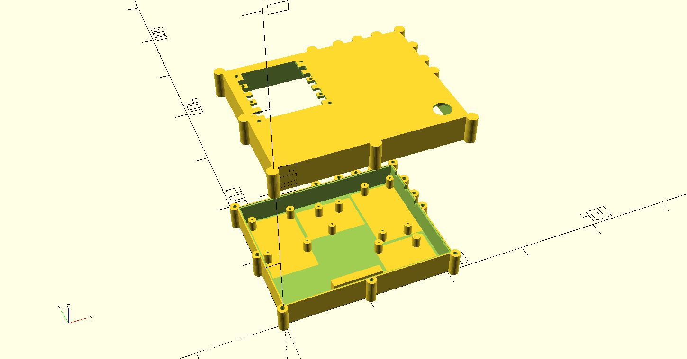
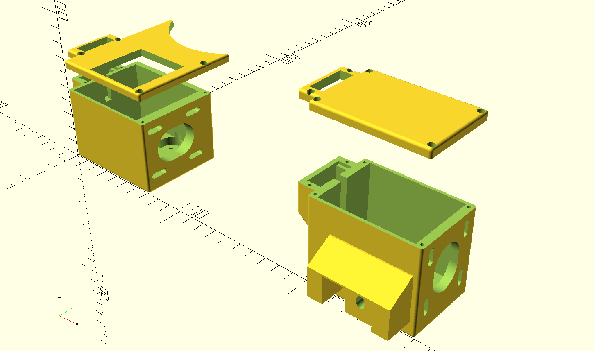
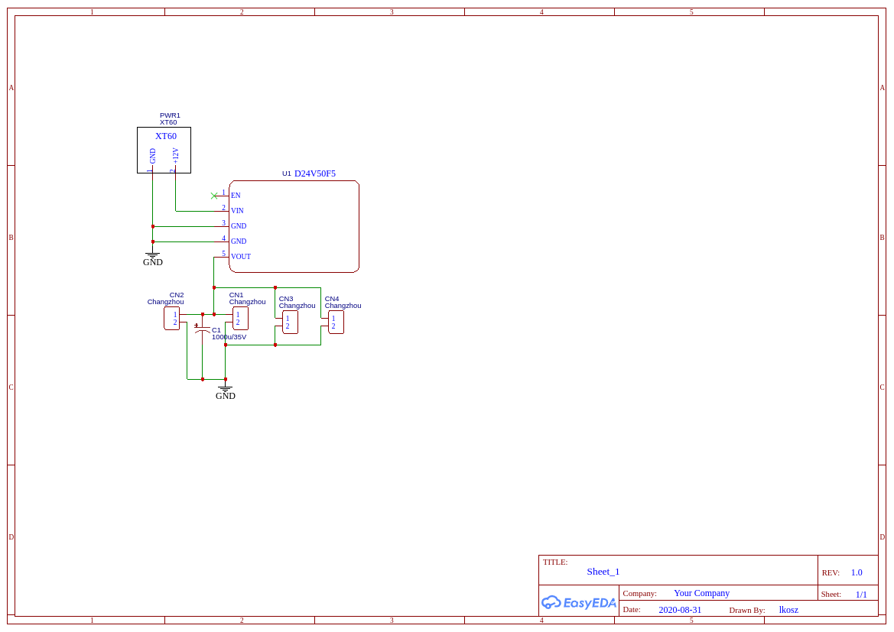
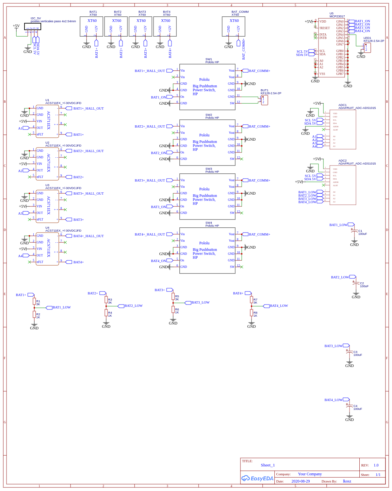
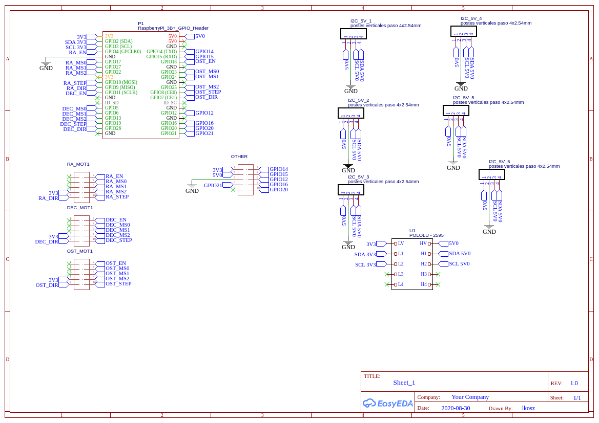
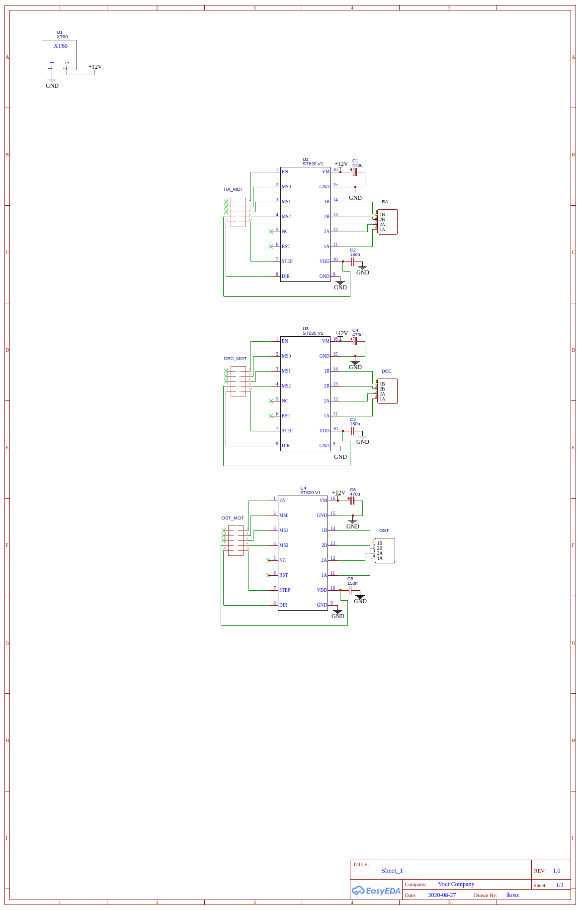
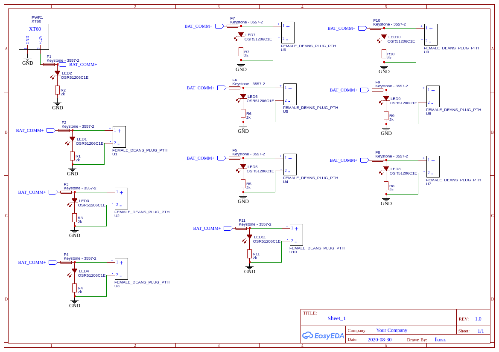

## DIY EQ5 GOTO

It can be installed using two puppet classes:
- eq_telescope
- eq_telescope_ra

it install everything. You need Raspberry (4B, at least 3B) and Raspbian. Can be controlled using app1.py from here: [https://github.com/lkosz/astro_camera_gui](https://github.com/lkosz/astro_camera_gui)

### 3D printed parts:
scad files are in 3d dir

### PCB

Below schematics. Gerber files are in PCB dir.

